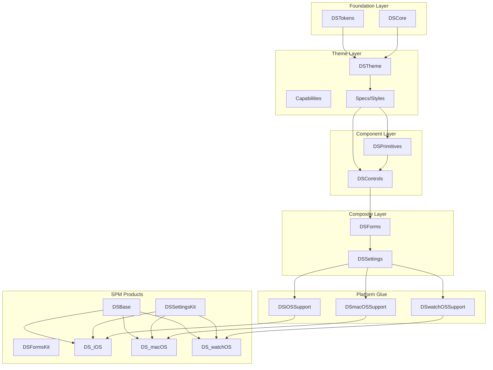

# SwiftUI Design System v0 Implementation Plan

## Overview

This plan implements a modular SwiftUI Design System following the layered architecture:
`Tokens -> Theme -> Specs/Styles -> Primitives -> Controls -> Forms -> Settings`

Focus v0: **Forms + Settings** for iOS, macOS, and watchOS.

---

## Phase 1: Repository and Foundation (Steps 1-5)

### Step 1: Repository Structure Setup

**Goal:** Establish the modular SPM package structure with proper directory layout.

**Artifacts:**

- Restructured `Package.swift` with all target declarations
- Directory structure for all modules:
  ```
  Sources/
    DSCore/
    DSTokens/
    DSTheme/
    DSPrimitives/
    DSControls/
    DSForms/
    DSSettings/
    DSiOSSupport/
    DSmacOSSupport/
    DSwatchOSSupport/
  Tests/
    DSCoreTests/
    DSThemeTests/
    DSControlsTests/
    DSFormsTests/
    DSSettingsTests/
  ```

**Definition of Done:**

- Package compiles on all platforms (iOS 17+, macOS 14+, watchOS 10+)
- All targets have placeholder files
- Products defined: `DSBase`, `DSFormsKit`, `DSSettingsKit`, `DS_iOS`, `DS_macOS`, `DS_watchOS`

**Dependencies:** None

**Notes:**

- Use `.when(platforms:)` in Package.swift for platform-specific targets
- Platform support targets should be conditionally compiled

---

### Step 2: Showcase Workspace Setup

**Goal:** Create a multi-platform Showcase app workspace for visual testing and component catalog.

**Artifacts:**

- `Showcase/` directory with Xcode workspace
- `ShowcaseiOS/` - iOS app target
- `ShowcasemacOS/` - macOS app target  
- `ShowcasewatchOS/` - watchOS app target
- Shared `ShowcaseCore/` with demo data and navigation

**Definition of Done:**

- All three apps compile and launch
- Apps link to the local SPM package
- Basic navigation structure in place (TabView/Sidebar)

**Dependencies:** Step 1

**Notes:**

- Showcase lives in same repo but separate from SPM package
- Use Xcode workspace to include both Package and Showcase projects

---

### Step 3: DSCore - Platform Abstractions

**Goal:** Implement platform-agnostic foundation types and metrics.

**Artifacts:**

- `DSPlatform.swift` - Platform enum and detection
- `DSInputMode.swift` - touch/pointer/keyboard modes
- `DSAccessibilityPolicy.swift` - reduceMotion, increasedContrast, dynamicType wrappers
- `DSControlState.swift` - pressed/hovered/focused/disabled/loading/selected/validation states
- `DSValidationState.swift` - none/error/warning/success with messages
- `DSEnvironmentKeys.swift` - Theme/Capabilities injection keys
- `DSTypeErasure.swift` - AnyView helpers for row composition

**Definition of Done:**

- All types compile without SwiftUI view dependencies
- Unit tests for state transitions and platform detection
- Environment keys functional

**Dependencies:** Step 1

**Notes:**

- DSCore must remain UI-free (no SwiftUI views)
- Platform detection uses minimal `#if os()` in one file

---

### Step 4: DSTokens - Raw Scales

**Goal:** Implement raw design tokens from reference images and guidelines.

**Artifacts:**

- `DSColorPalette.swift`:
  - Light neutrals (N0-N9)
  - Dark neutrals (D0-D9)
  - Accent palettes (Teal, Indigo, Green, Yellow, Red, Blue with dark-safe variants)
- `DSTypographyScale.swift`:
  - Size scale (36, 29, 22, 17, 16, 13, 12, 11 pt)
  - Weight scale (regular 400, semibold 600)
- `DSSpacingScale.swift`:
  - XS(4), S(6/8), M(12), L(16), XL(24), XXL(32), Max(64)
- `DSRadiusScale.swift`:
  - S(6), M(10), L(14-16), XL(24)
- `DSShadowScale.swift`:
  - shadow.0 (none), shadow.1 (cards), shadow.2 (overlays)
- `DSMotionScale.swift`:
  - duration tokens, spring presets, easing curves

**Definition of Done:**

- All token values match reference images
- Tokens are raw values (CGFloat, String hex) not SwiftUI types
- Unit tests verify token values

**Dependencies:** Step 1

**Notes:**

- Tokens are "raw material" - no semantic meaning here
- Dark theme accents have reduced saturation per guidelines

---

### Step 5: DSTheme - Semantic Roles Container

**Goal:** Create the theme container with semantic color/typography/spacing roles.

**Artifacts:**

- `DSTheme.swift` - Main container struct
- `DSColors.swift` - Semantic color roles:
  - bg (canvas, surface, surfaceElevated, card)
  - fg (primary, secondary, tertiary, disabled)
  - border (subtle, strong), separator
  - accent (primary, secondary)
  - state (success, warning, danger, info)
  - focusRing
- `DSTypography.swift` - Text roles:
  - largeTitle, title1-3, headline, body, callout, subheadline, footnote, caption1-2
  - buttonLabel, fieldText, helperText, rowTitle, rowValue, sectionHeader, badgeText
- `DSSpacing.swift` - Semantic spacing roles
- `DSRadii.swift` - Corner radius roles
- `DSShadows.swift` - Elevation roles
- `DSMotion.swift` - Animation roles
- `DSDensity.swift` - compact/regular/spacious enum

**Definition of Done:**

- Theme struct contains all semantic role categories
- Theme can be initialized with different token sets
- Theme accessible via @Environment

**Dependencies:** Steps 3, 4

---

## Phase 2: Theme Resolution and Capabilities (Steps 6-9)

### Step 6: DSCapabilities System

**Goal:** Implement platform capabilities for auto-degradation.

**Artifacts:**

- `DSCapabilities.swift`:
  - `supportsHover: Bool`
  - `supportsFocusRing: Bool`
  - `supportsInlineTextEditing: Bool`
  - `supportsInlinePickers: Bool`
  - `supportsToasts: Bool`
  - `prefersLargeTapTargets: Bool`
  - `preferredFormRowLayout: FormRowLayout` (stacked/inline/twoColumn)
  - `preferredPickerPresentation: PickerPresentation` (sheet/popover/menu/navigation)
  - `preferredTextFieldMode: TextFieldMode` (inline/separateScreen)
- `DSCapabilities+Platform.swift` - Default capabilities per platform:
  - iOS: inline text, sheet pickers, no hover
  - macOS: hover, focus ring, popover/menu pickers, twoColumn forms
  - watchOS: no inline text, navigation pickers, large tap targets, stacked layout

**Definition of Done:**

- Capabilities enum/struct fully defined
- Platform defaults implemented
- Capabilities injectable via Environment
- Unit tests for platform capability mapping

**Dependencies:** Step 3

**Notes:**

- Components use capabilities for `.auto` behavior
- No `#if os()` in component files - only capabilities queries

---

### Step 7: ThemeResolver Implementation

**Goal:** Create resolver that generates theme from tokens + environment.

**Artifacts:**

- `DSThemeResolver.swift`:
  - Input: DSTokens + DSThemeVariant (light/dark) + DSAccessibilityPolicy + DSDensity + DSPlatform
  - Output: Complete DSTheme
- `DSThemeVariant.swift` - light/dark/highContrast variants
- `DSThemeModifier.swift` - `.dsTheme(_:)` view modifier
- `DSDefaultThemes.swift` - Pre-built light/dark themes

**Definition of Done:**

- Resolver correctly maps tokens to semantic roles
- Light theme uses N-palette, dark theme uses D-palette
- High contrast mode increases border/text contrast
- Reduce motion disables/simplifies animations
- Dynamic type scales typography
- Unit tests for all variant combinations

**Dependencies:** Steps 4, 5, 6

**Notes:**

- ThemeResolver is the ONLY place that considers accessibility/platform
- Components never check system color scheme directly

---

### Step 8: DSStyles Registry - Spec Protocols

**Goal:** Define component specification protocols for resolve-then-render pattern.

**Artifacts:**

- `DSSpec.swift` - Base spec protocol
- `DSButtonSpec.swift`:
  - Variants: primary, secondary, tertiary, destructive
  - Sizes: small, medium, large
  - States: normal, pressed, disabled, loading
  - Resolved properties: bg, fg, border, radius, height, typography, animation
- `DSFieldSpec.swift`:
  - Variants: default, search
  - States: normal, focused, error, disabled
  - Resolved: bg, fg, border, placeholder, radius, height, typography
- `DSToggleSpec.swift` - Toggle/checkbox styling
- `DSFormRowSpec.swift`:
  - Layouts: inline, stacked, twoColumn
  - Resolved: spacing, labelWidth, contentAlignment
- `DSCardSpec.swift` - Card elevation and styling
- `DSListRowSpec.swift` - Row height, padding, accessory

**Definition of Done:**

- All spec protocols defined with resolve methods
- Specs return complete styling information
- Unit tests for spec resolution with different inputs

**Dependencies:** Step 5

**Notes:**

- Specs are pure data - no SwiftUI views
- Resolve takes (variant, size, state, metrics) returns concrete values

---

### Step 9: DSStyles Default Implementations

**Goal:** Implement default spec resolvers in theme.

**Artifacts:**

- `DSComponentStyles.swift` - Registry container in theme
- Default resolvers for each spec type
- Integration with theme environment

**Definition of Done:**

- Theme contains componentStyles with all spec resolvers
- Components can resolve specs from theme
- Specs customizable via theme override

**Dependencies:** Step 8

---

## Phase 3: Primitives (Steps 10-13)

### Step 10: DSText Primitive

**Goal:** Role-based text component using theme typography.

**Artifacts:**

- `DSText.swift`:
  - Init with role (DSTextRole enum)
  - Automatic font/color from theme
  - Support for weight/color override
- `DSTextRole.swift` - All typography roles enum

**Definition of Done:**

- DSText renders with theme typography
- Dynamic Type supported
- Shown in Showcase

**Dependencies:** Steps 5, 7

---

### Step 11: DSIcon Primitive

**Goal:** SF Symbols wrapper with theme integration.

**Artifacts:**

- `DSIcon.swift`:
  - Init with SF Symbol name
  - Size tokens: small(16), medium(20), large(24), xl(32)
  - Color from semantic role or override
- `DSIconSize.swift` - Size enum
- `DSIconToken.swift` - Common icon name constants (chevron, checkmark, etc.)

**Definition of Done:**

- DSIcon renders SF Symbols only (no custom assets)
- Accessibility labels automatic from symbol name
- Shown in Showcase

**Dependencies:** Steps 5, 7

**Notes:**

- SF Symbols only per requirements - no icon assets in v0

---

### Step 12: DSSurface and DSCard Primitives

**Goal:** Background and elevation containers.

**Artifacts:**

- `DSSurface.swift`:
  - Semantic background roles (canvas, surface, elevated)
  - Optional stroke
- `DSCard.swift`:
  - Uses DSCardSpec
  - Elevation levels (flat, raised, overlay)
  - Corner radius from spec
  - Optional glass effect background (dark theme)
- `DSDivider.swift`:
  - Horizontal/vertical variants
  - Color from theme separator

**Definition of Done:**

- Cards match reference images (soft shadows, subtle borders)
- Glass effect working on dark theme
- Shown in Showcase with elevation comparison

**Dependencies:** Steps 8, 9

---

### Step 13: DSLoader Primitive

**Goal:** Loading and progress indicators.

**Artifacts:**

- `DSLoader.swift`:
  - Indeterminate spinner
  - Size variants matching icon sizes
- `DSProgress.swift`:
  - Linear progress bar
  - Circular progress ring
  - Color from accent.primary

**Definition of Done:**

- Animations respect reduce motion
- Theme-colored
- Shown in Showcase

**Dependencies:** Step 7

---

## Phase 4: Controls MVP (Steps 14-19)

### Step 14: DSButton Control

**Goal:** Primary interactive button with all variants.

**Artifacts:**

- `DSButton.swift`:
  - Variants: primary, secondary, tertiary, destructive
  - Sizes: small, medium, large
  - States: normal, pressed, disabled, loading
  - Resolves DSButtonSpec from theme
- `DSButtonStyle.swift` - SwiftUI ButtonStyle implementation

**Definition of Done:**

- All variants match design guidelines
- Pressed/hover states animated
- Loading state shows spinner
- Disabled state visual
- Full accessibility (labels, traits)
- Shown in Showcase with all states

**Dependencies:** Steps 8, 9, 11, 13

---

### Step 15: DSToggle Control

**Goal:** Toggle/switch control with optional checkbox on macOS.

**Artifacts:**

- `DSToggle.swift`:
  - Standard toggle appearance
  - Disabled state
  - Custom tint from accent.primary
- `DSCheckbox.swift` (macOS variant):
  - Checkbox appearance for lists
  - Intermediate state support

**Definition of Done:**

- Toggle uses theme accent color
- Checkbox variant only on macOS (via capabilities check, not #if)
- Accessibility complete
- Shown in Showcase

**Dependencies:** Steps 8, 9

**Notes:**

- macOS checkbox shown via capability check, not compile-time #if

---

### Step 16: DSTextField Control

**Goal:** Text input with validation and chrome.

**Artifacts:**

- `DSTextField.swift`:
  - Standard text input
  - Resolves DSFieldSpec
  - Focus ring on focus
  - Error/warning border states
- `DSSecureField.swift` - Password input variant
- `DSMultilineField.swift` - TextEditor wrapper
- `DSFieldChrome.swift`:
  - Label slot
  - Helper/error text
  - Required marker
  - Character count (optional)

**Definition of Done:**

- Fields match reference images (borders, focus states)
- Validation states (error red, warning yellow, success green)
- Placeholder text styled
- Keyboard submit/next works on iOS
- Shown in Showcase with all states

**Dependencies:** Steps 8, 9, 10

---

### Step 17: DSPicker Control

**Goal:** Single selection picker with platform-appropriate presentation.

**Artifacts:**

- `DSPicker.swift`:
  - Generic selection interface
  - Presentation mode: `.auto`, `.sheet`, `.popover`, `.menu`, `.navigation`
  - Auto mode uses capabilities.preferredPickerPresentation
- `DSPickerPresentation.swift` - Presentation enum

**Definition of Done:**

- iOS: sheet presentation by default
- macOS: popover/menu presentation
- watchOS: navigation list presentation
- Selection highlighted with accent color
- Shown in Showcase on each platform

**Dependencies:** Steps 6, 8, 9

**Notes:**

- Platform behavior via capabilities, not #if os()
- watchOS navigation picker implemented in platform glue

---

### Step 18: DSStepper Control

**Goal:** Numeric stepper control.

**Artifacts:**

- `DSStepper.swift`:
  - Increment/decrement buttons
  - Value display
  - Min/max bounds
  - Step amount

**Definition of Done:**

- Styled with theme tokens
- Disabled at bounds
- Accessibility increment/decrement actions
- Shown in Showcase

**Dependencies:** Steps 9, 14

---

### Step 19: DSSlider Control (Optional for v0)

**Goal:** Range slider with optional discrete steps.

**Artifacts:**

- `DSSlider.swift`:
  - Continuous and discrete modes
  - Track and thumb styling
  - Value labels (optional)
- `DSSliderFallback.swift`:
  - Stepper-based fallback for watchOS
  - Shown when capabilities.supportsInlinePickers is false

**Definition of Done:**

- Slider themed with accent colors
- watchOS auto-falls back to discrete stepper/picker
- Shown in Showcase

**Dependencies:** Steps 6, 9, 18

---

## Phase 5: Forms MVP (Steps 20-24)

### Step 20: DSForm Container

**Goal:** Form container with grouped sections.

**Artifacts:**

- `DSForm.swift`:
  - Container view
  - Passes form configuration via Environment
  - Keyboard avoidance (iOS)
- `DSFormConfiguration.swift`:
  - Layout mode: auto/stacked/inline/twoColumn
  - Validation display mode
  - Density override

**Definition of Done:**

- Form groups content properly
- Keyboard avoidance on iOS
- Two-column preset on macOS
- Stacked layout on watchOS
- Shown in Showcase

**Dependencies:** Step 6

---

### Step 21: DSFormSection

**Goal:** Section grouping with header/footer.

**Artifacts:**

- `DSFormSection.swift`:
  - Header view slot
  - Footer view slot
  - Collapsible option (macOS)
- `DSSectionHeader.swift` - Styled header with optional icon
- `DSSectionFooter.swift` - Styled footer with description text

**Definition of Done:**

- Sections visually separated
- Header/footer styled per guidelines
- Collapsible works on macOS
- Shown in Showcase

**Dependencies:** Step 20

---

### Step 22: DSFormRow Layout System

**Goal:** Flexible row layout component.

**Artifacts:**

- `DSFormRow.swift`:
  - Layout modes: inline, stacked, twoColumn
  - Auto mode selects based on capabilities
  - Slots: label, control, accessory, footer
- `DSFormRowLayout.swift` - Layout enum
- `DSFormRowBuilder.swift` - Result builder for row content

**Definition of Done:**

- Inline layout: label left, control right
- Stacked layout: label top, control bottom
- Two-column: label in fixed-width column (macOS)
- watchOS always stacked
- Shown in Showcase with layout comparison

**Dependencies:** Steps 6, 9

**Notes:**

- Row layout adapts via capabilities, no #if in component

---

### Step 23: Form Validation System

**Goal:** Validation state propagation and display.

**Artifacts:**

- `DSValidationView.swift`:
  - Error/warning/success message display
  - Icon + text styling
- `DSFormValidation.swift`:
  - Validation state container
  - Propagation through form hierarchy
- `DSRequiredMarker.swift` - Asterisk with accessibility

**Definition of Done:**

- Validation messages appear below fields
- Error state shows red icon + text
- Required marker is accessible
- Shown in Showcase with all states

**Dependencies:** Steps 3, 16

---

### Step 24: Focus Chain Integration

**Goal:** Keyboard navigation and submit chain.

**Artifacts:**

- `DSFocusChain.swift`:
  - @FocusState management
  - Next/previous field navigation
  - Submit action on last field
- `DSFormSubmit.swift` - Submit button integration

**Definition of Done:**

- iOS: keyboard next/done buttons work
- macOS: Tab navigation works
- Submit triggers form action
- Shown in Showcase demo form

**Dependencies:** Step 16

---

## Phase 6: Settings Patterns MVP (Steps 25-31)

### Step 25: DSNavigationRow

**Goal:** Navigation row with title, value, and chevron.

**Artifacts:**

- `DSNavigationRow.swift`:
  - Title (required)
  - Subtitle (optional)
  - Value (optional)
  - Leading icon (SF Symbol)
  - Trailing chevron
  - Tap action

**Definition of Done:**

- Chevron aligned right
- Row styled per DSListRowSpec
- Hover state on macOS
- Large tap target on watchOS
- Shown in Showcase

**Dependencies:** Steps 9, 10, 11

---

### Step 26: DSToggleRow

**Goal:** Row with integrated toggle.

**Artifacts:**

- `DSToggleRow.swift`:
  - Title
  - Subtitle (optional)
  - Leading icon (optional)
  - Integrated DSToggle
  - Binding to Bool

**Definition of Done:**

- Toggle positioned right
- Disabled state propagates
- Accessibility: adjustable trait
- Shown in Showcase

**Dependencies:** Steps 15, 25

---

### Step 27: DSPickerRow

**Goal:** Row that opens picker selection.

**Artifacts:**

- `DSPickerRow.swift`:
  - Title
  - Selected value display
  - Presentation mode: auto/sheet/navigation
  - Generic selection type
- Integrates DSPicker with automatic presentation

**Definition of Done:**

- iOS: tapping opens sheet
- macOS: tapping opens popover/menu
- watchOS: tapping navigates to selection list
- Selected value shown in row
- Shown in Showcase on all platforms

**Dependencies:** Steps 17, 25

---

### Step 28: DSTextFieldRow

**Goal:** Row with text input, auto-adapting to platform.

**Artifacts:**

- `DSTextFieldRow.swift`:
  - Title/label
  - Edit mode: auto/inline/separateScreen
  - Validation integration
  - Placeholder
- `DSTextFieldEditScreen.swift`:
  - Full-screen edit view for watchOS
  - Navigation presentation

**Definition of Done:**

- iOS/macOS: inline editing
- watchOS: tapping navigates to edit screen
- Validation messages shown
- Keyboard submit works
- Shown in Showcase on all platforms

**Dependencies:** Steps 6, 16, 22

**Notes:**

- Edit mode determined by capabilities.preferredTextFieldMode

---

### Step 29: DSInfoRow

**Goal:** Read-only key-value display with optional copy.

**Artifacts:**

- `DSInfoRow.swift`:
  - Label
  - Value (monospace optional)
  - Copy to clipboard action (optional)
  - Selectable text option

**Definition of Done:**

- Value right-aligned
- Copy feedback (haptic/visual)
- Accessibility: copy action announced
- Shown in Showcase

**Dependencies:** Step 25

---

### Step 30: DSActionRow and DSDestructiveRow

**Goal:** Action buttons in row format.

**Artifacts:**

- `DSActionRow.swift`:
  - Title
  - Leading icon (optional)
  - Action closure
  - Subtle vs prominent styling
- `DSDestructiveRow.swift`:
  - Red destructive styling
  - Requires confirmation
  - Confirmation dialog/alert
- `DSConfirmationDialog.swift`:
  - Platform-appropriate confirmation
  - Title, message, confirm/cancel actions

**Definition of Done:**

- Destructive row is red
- Confirmation prevents accidental taps
- Confirmation uses alert (iOS/watch) or dialog (macOS)
- Shown in Showcase with confirm flow

**Dependencies:** Steps 14, 25

---

### Step 31: DSNoticeBlock

**Goal:** Inline banner/notice for settings.

**Artifacts:**

- `DSNoticeBlock.swift`:
  - Variants: info, warning, success, error
  - Icon + title + description
  - Optional action button
  - Dismissible option

**Definition of Done:**

- Colors match state tokens
- Icon appropriate to variant
- Action button styled as tertiary
- Shown in Showcase with all variants

**Dependencies:** Steps 10, 11, 12

---

## Phase 7: Platform Glue (Steps 32-34)

### Step 32: DSiOSSupport

**Goal:** iOS-specific integrations.

**Artifacts:**

- `DSiOSSupport/`:
  - `DSPickerSheetPresenter.swift` - Sheet presentation for pickers
  - `DSKeyboardChain.swift` - Keyboard toolbar with next/done
  - `DSLargeTitleIntegration.swift` - Navigation large title support
  - `DSHaptics.swift` - Haptic feedback wrappers

**Definition of Done:**

- Picker sheet presentation works
- Keyboard chain with next/done
- No #if os() leaks to other modules
- Integration tested in Showcase iOS

**Dependencies:** Steps 17, 24

---

### Step 33: DSmacOSSupport

**Goal:** macOS-specific integrations.

**Artifacts:**

- `DSmacOSSupport/`:
  - `DSHoverStyle.swift` - Hover effect modifiers
  - `DSFocusRingStyle.swift` - Focus ring customization
  - `DSToolbarIntegration.swift` - Toolbar presets
  - `DSTwoColumnFormPreset.swift` - Two-column form layout
  - `DSPickerPopoverPresenter.swift` - Popover/menu pickers

**Definition of Done:**

- Hover states work on rows/buttons
- Focus ring matches theme
- Two-column forms work
- No #if os() leaks to other modules
- Integration tested in Showcase macOS

**Dependencies:** Steps 17, 22

---

### Step 34: DSwatchOSSupport

**Goal:** watchOS-specific implementations.

**Artifacts:**

- `DSwatchOSSupport/`:
  - `DSNavigationPicker.swift` - Navigation-based picker list
  - `DSEditScreenPresenter.swift` - Separate edit screen for text
  - `DSLargeTapTarget.swift` - Hit area expansion
  - `DSDiscretePicker.swift` - Stepper alternative for slider
  - `DSStackedFormRow.swift` - Forced stacked layout

**Definition of Done:**

- Text field navigates to edit screen
- Picker navigates to selection list
- Slider falls back to discrete stepper
- All tap targets >= 44pt
- Integration tested in Showcase watchOS

**Dependencies:** Steps 17, 19, 28

---

## Phase 8: Documentation and Testing (Steps 35-38)

### Step 35: Documentation Files

**Goal:** Create comprehensive documentation.

**Artifacts:**

- `docs/ARCHITECTURE.md`:
  - Layer diagram and dependencies
  - Why semantic roles (not raw tokens) in components
  - Resolve-then-render pattern explanation
- `docs/THEMING.md`:
  - How to create custom theme
  - Token to role mapping
  - How to override component specs
  - Environment injection guide
- `docs/TOKENS.md`:
  - Complete token reference
  - Color palettes with hex values
  - Typography scale
  - Spacing/radius/shadow scales
- `docs/CAPABILITIES.md`:
  - Platform capability matrix table
  - Auto-degradation rules
  - How to query capabilities
- `docs/FORMS.md`:
  - Form row layouts explained
  - Validation integration
  - Focus chain setup
  - Slot architecture
- `docs/SETTINGS_COOKBOOK.md`:
  - General settings screen example
  - Privacy settings example
  - About screen example
  - Account settings example
- `docs/TESTING.md`:
  - Testing strategy overview
  - Unit test targets
  - UI test approach
  - Snapshot testing setup

**Definition of Done:**

- All docs written with code examples
- Mermaid diagrams for architecture
- Platform-specific sections where needed

**Dependencies:** Steps 1-34

---

### Step 36: Unit Tests

**Goal:** Comprehensive unit test coverage for non-UI logic.

**Artifacts:**

- `DSCoreTests/`:
  - State transition tests
  - Platform detection tests
- `DSTokensTests/`:
  - Token value verification
- `DSThemeTests/`:
  - ThemeResolver tests:
    - Light/dark variant resolution
    - High contrast adjustments
    - Reduce motion behavior
    - Dynamic type scaling
    - Density mapping
  - Capabilities mapping tests per platform
- `DSStylesTests/`:
  - ButtonSpec resolve tests
  - FieldSpec resolve tests
  - FormRowSpec auto-layout tests

**Definition of Done:**

- All resolvers have test coverage
- Platform capability tests pass
- CI runs tests on all platforms

**Dependencies:** Steps 6, 7, 8

---

### Step 37: UI Tests

**Goal:** Flow testing for critical user interactions.

**Artifacts:**

- `ShowcaseiOSUITests/`:
  - PickerRow opens sheet test
  - TextFieldRow focus/submit chain test
  - DestructiveRow confirm flow test
- `ShowcasemacOSUITests/`:
  - Hover states visible test
  - Focus ring visible test
  - Two-column form layout test
- `ShowcasewatchOSUITests/`:
  - PickerRow navigation test
  - TextFieldRow edit screen test
  - DestructiveRow confirm test

**Definition of Done:**

- Key flows automated
- Tests run in CI
- Platform-specific behaviors verified

**Dependencies:** Steps 25-34

---

### Step 38: Snapshot Tests (Optional)

**Goal:** Visual regression protection.

**Artifacts:**

- `SnapshotTests/` target:
  - Button states (all variants/states)
  - Field states (normal/focused/error/disabled)
  - Form layouts (inline/stacked/twoColumn)
  - Light/dark theme comparison
  - Dynamic type large accessibility
  - High contrast accessibility
- Golden image management script

**Definition of Done:**

- Key component states captured
- Light and dark themes covered
- CI compares against golden images

**Dependencies:** Steps 14-31

**Notes:**

- Use swift-snapshot-testing or similar
- Golden updates require manual approval

---

## Phase 9: Release Readiness (Step 39)

### Step 39: API Stabilization and Release Prep

**Goal:** Finalize public API and prepare for release.

**Artifacts:**

- `API.md` - Public API surface documentation
- Access control audit:
  - Public: View components, Theme, Capabilities, Tokens (for customization)
  - Internal: Specs internals, type erasure helpers
  - Private: Implementation details
- `CHANGELOG.md` - Version history
- `MIGRATION.md` - Breaking changes guide (for future)
- Semantic versioning setup (0.1.0 for v0 release)
- CI/CD pipeline for releases

**Definition of Done:**

- All public types documented
- No accidental public internals
- Changelog written
- Version tagged
- Package published to registry (or internal distribution)

**Dependencies:** Steps 35-38

---

## Architecture Diagram




---

## Capabilities Auto-Degradation Matrix


| Feature             | iOS            | macOS            | watchOS              |
| ------------------- | -------------- | ---------------- | -------------------- |
| Hover states        | Pointer only   | Yes              | No                   |
| Focus ring          | Keyboard only  | Yes              | No                   |
| Inline text editing | Yes            | Yes              | No (separate screen) |
| Inline pickers      | Sheet          | Popover/Menu     | No (navigation)      |
| Slider              | Yes            | Yes              | Stepper/discrete     |
| Form row layout     | inline/stacked | twoColumn/inline | stacked only         |
| Large tap targets   | No             | No               | Yes (44pt min)       |
| Toast notifications | Yes            | Yes              | No                   |


---

## Key Implementation Decisions

**1. Only capabilities determine platform behavior:**
Components query `DSCapabilities` not `#if os()`. Platform glue targets provide implementations.

**2. SF Symbols only:**
No custom icon assets in v0. All icons via `DSIcon` with SF Symbol names.

**3. Composable forms via slots:**
`DSFormRow` uses ViewBuilder slots (label, control, accessory, footer) for flexibility.

**4. Public API minimization:**
Export DSSettingsKit/DSFormsKit as main products. Internal specs exposed only for advanced customization.

**5. Glass effect implementation:**
Dark theme cards use `.background(.ultraThinMaterial)` with opacity + stroke for glass effect matching references.

**6. Dusty accents in dark theme:**
`TealDark A` (#17BDB0) instead of bright `Teal 400` for primary accent in dark mode per guidelines.